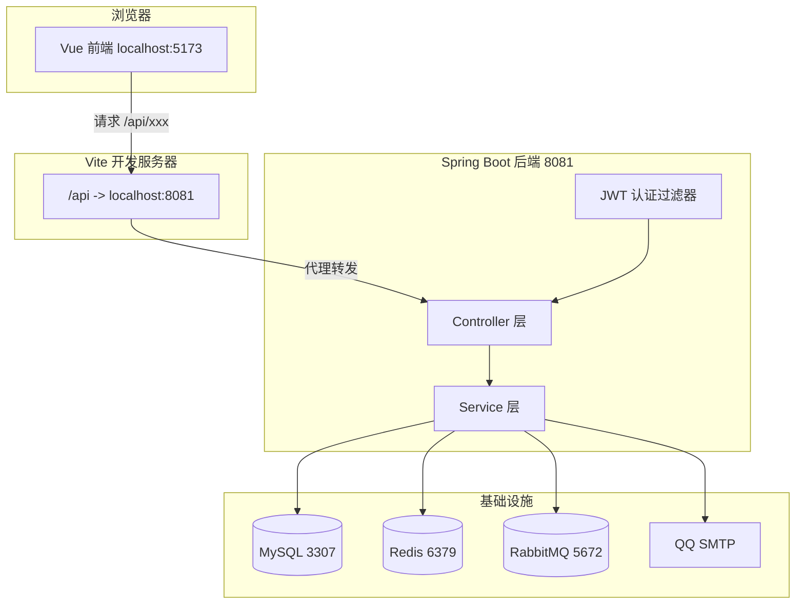
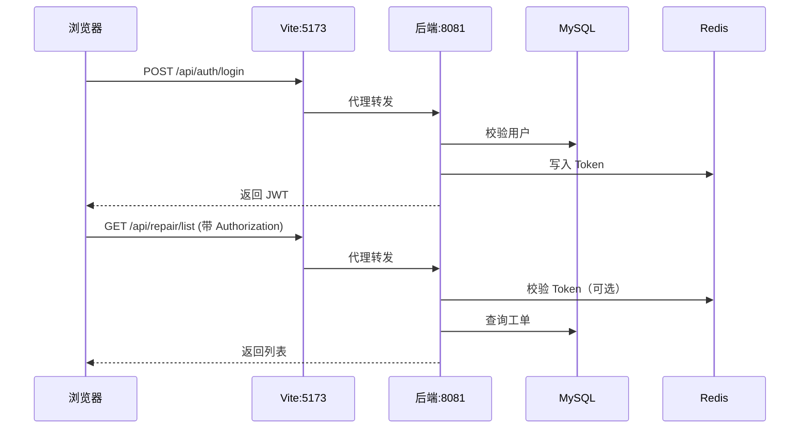

# 校园报修系统 - 架构与排错梳理

## 一、自上而下的架构图



## 二、各层职责与依赖

| 层级           | 位置                                                 | 职责                                   | 依赖                                                                                 |
| -------------- | ---------------------------------------------------- | -------------------------------------- | ------------------------------------------------------------------------------------ |
| **前端**       | [frontend/](frontend/)                               | Vue 3 + Element Plus；管理员 PC 后台，学生/维修工响应式 Web | 请求 `baseURL=/api`，通过 Vite 代理                                                   |
| **代理**       | [frontend/vite.config.js](frontend/vite.config.js)   | 将 `/api` 转发到 `http://localhost:8081` | 后端必须在 8081 启动                                                                 |
| **后端**       | [backend/](backend/)                                 | Spring Boot，REST API、认证、业务逻辑   | MySQL、Redis、RabbitMQ                                                                |
| **MySQL**      | 3307                                                 | 主数据：用户、工单、日志等              | 需执行 [backend/src/main/resources/schema.sql](backend/src/main/resources/schema.sql) |
| **Redis**      | 6379                                                 | Token、邮箱验证码、防重复提交、短期缓存    | 多数路径有降级，正式验收建议启动                                                      |
| **RabbitMQ**   | 5672                                                 | 异步通知、日志                          | 通知相关功能依赖                                                                      |
| **QQ SMTP**    | 465                                                  | 邮箱验证码发信                          | `spring.mail.*`，password 为授权码                                                     |

## 三、请求链路示例（以登录、报修列表为例）



## 四、当前错误与根因对应

| 前端显示 / 状态码 | 后端异常                        | 根因                               |
| ----------------- | ------------------------------- | ---------------------------------- |
| **数据库异常** (500) | `DataAccessException`           | MySQL 未启动、未建库建表、端口/密码错误 |
| **服务暂不可用** (503) | `RedisConnectionFailureException` | 某处仍直连 Redis 失败（如未启动/密码错）；**邮箱验证码**已支持 Redis 不可用时内存降级，发码/验码一般不再因此 503 |
| **系统繁忙** (500) | `Exception` 兜底                 | 可能是 DB/Redis/RabbitMQ 任一异常未单独处理 |
| ws proxy ECONNRESET | -                               | 后端未启动或重启，WebSocket 连接被重置 |

## 五、正确启动顺序（本地开发）

### 1. 启动中间件

```bash
docker-compose up -d mysql redis rabbitmq
```

### 2. 初始化数据库（首次或清库后）

- 建表：`mysql --default-character-set=utf8mb4 -h 127.0.0.1 -P 3307 -u root -p campus_repair < backend/src/main/resources/schema.sql`
- 旧库迁移：`mysql --default-character-set=utf8mb4 -h 127.0.0.1 -P 3307 -u root -p campus_repair < sql/migration_add_sys_user_email.sql`
- 初始账号：`backend/src/main/resources/init_data.sql`
- 多账号/样例数据：`init_all_accounts.sql`、`sql/fix_user_display_data.sql`、`sql/seed_repair_orders_50.sql`

### 3. 启动后端

```bash
cd backend && mvn spring-boot:run
```

- 成功标志：控制台出现 `Tomcat started on port(s): 8081`

### 4. 启动前端

```bash
cd frontend && npm run dev
```

- 访问 `http://localhost:5173`

## 六、验证指南中的关键配置

| 配置项   | 值             | 文件                                                                         |
| -------- | -------------- | ---------------------------------------------------------------------------- |
| MySQL 端口 | 3307（宿主机） | [application.yml](backend/src/main/resources/application.yml)、docker-compose |
| Redis 密码 | 123321         | application.yml、docker-compose                                              |
| 后端端口 | 8081           | application.yml、vite proxy                                                  |
| 数据库名 | campus_repair  | application.yml、docker-compose                                              |
| 邮箱 SMTP | smtp.qq.com:465 | application.yml 中 `spring.mail.*`                                           |

## 七、最小可用运行（Redis/RabbitMQ 降级）

若希望「最小可用」运行（如仅登录、报修，暂不依赖 Redis/RabbitMQ），项目已在以下位置做 try-catch 降级：

- **AuthController**：登录时写入 Token、登出时删除 Token，Redis 失败不阻断
- **JwtAuthenticationFilter**：校验 Token 时 Redis 不可用则仅用 JWT 校验
- **RepairServiceImpl**：防重提交锁等短期控制，Redis 失败时降级不阻断主流程
- **UserServiceImpl**：用户缓存读写，Redis 失败时直接查库
- **NotifyService**：WebSocket/RabbitMQ 通知，连接失败时记录日志不抛出
- **EmailVerificationService**：Redis 不可用时邮箱验证码使用进程内内存降级

**注意**：正式答辩演示仍建议启动 Redis/RabbitMQ，降级只用于本机临时排错，不作为生产方案。

当前问题本质是：**MySQL 或 Redis 未就绪**。按「五、正确启动顺序」依次执行即可恢复。
